### Initialising pyspark setup in google colab
```bash
!pip install pyspark
```
```bash
!pip install -q findspark
```
```bash
import findspark
findspark.init()
```

---

### Creating Spark Session
```python
# creating a spark session that will be used to perform all the necessary task on Spark
from pyspark.sql import SparkSession
spark = SparkSession.builder.master("local[*]").appName('df-agg-operations').getOrCreate()
spark
```

---

# [Solution 1](https://github.com/RahulRoy-rsp/Learning_PySpark/blob/main/Aggregation_Operations/df-agg-exercise.md#exercise-1-create-a-dataframe-with-specific-data-types-and-do-the-following-operation)

- Create a DataFrame with specific columns and datatypes & Insert records

    ```python
    from pyspark.sql.types import StructType, StructField, StringType, IntegerType

    # Defining the schema
    schema = StructType([
        StructField("player_name", StringType(), True),
        StructField("matches", IntegerType(), True),
        StructField("goals_scored", IntegerType(), True),
        StructField("team_name", StringType(), True)
    ])

    # data for the dataframe
    data = [
    ("Christiano Ronaldo", 7, 12, "Spain"),
    ("Lionel Messi", 6, 11, "Argentica"),
    ("Luka Modric", 5, 9, "Croatia"),
    ("Harry Kane", 5, 12, "England"),
    ("Vinicius Junior", 4, 7, "Brazil"),
    ("Sergio Ramos", 7, 5, "Spain"),
    ("Neymar Da Silva", 4, 9, "Brazil")
    ]

    # Creating the DataFrame
    df1 = spark.createDataFrame(data, schema=schema)  
    ```

- Displaying the dataframe.
    ```python
    df1.show()
    ```
    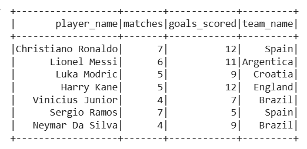

- Show the number of records in the dataframe.
    ```python
    df1.count()
    ```
    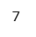

- Show the dataframe with only the following columns: player_name and goals_scored.
    ```python
    df1.select("player_name", "goals_scored").show()
    ```
    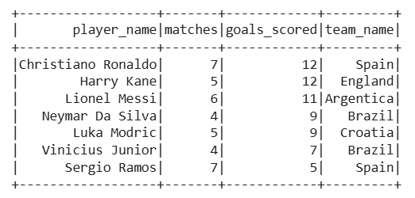

- Show the dataframe sorted by the column goals_scored in descending order.
    ```python
    df1.sort("goals_scored", ascending=False).show()
    ```
    


- Show the total number of goals_scored in the dataframe.
    ```python
    from pyspark.sql.functions import sum

    total_goals = df1.select(sum(df1.goals_scored).alias("Total Goals"))
    total_goals.show()
    ```

- Show the average number of goals_scored in the dataframe.
    ```python
    from pyspark.sql.functions import avg

    avg_goals = df1.select(avg(df1.goals_scored).alias("Average Goals"))
    avg_goals.show()
    ```
    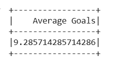

- Show the records from the dataframe where the team_name is Spain.
    ```python
    df1.filter(df1.team_name == "Spain").show()
    ```
    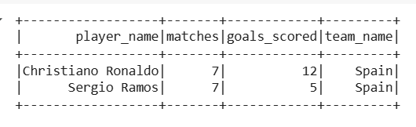

- Show the result set from the dataframe with the columns as Max Goals, Min Goals, Total Goals, Average Goals for each team_name.
    ```python
    from pyspark.sql.functions import min, max
    teams_group = df1.groupby("team_name").agg(
        max("goals_scored").alias("Max Goals"),
        min("goals_scored").alias("Min Goals"),
        sum("goals_scored").alias("Total Goals"),
        avg("goals_scored").alias("Average Goals")
        )

    teams_group.show()
    ```
    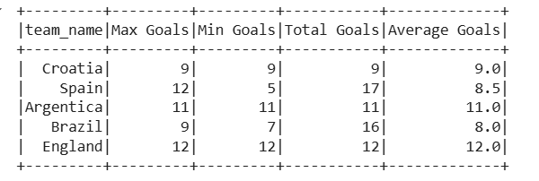

- Show the player_name who scored the most goals, (Columns to show:player_name, goals_scored).
    ```python
    max_goals = df1.select(max(df1.goals_scored)).collect()[0][0]

    df1.filter(df1.goals_scored == max_goals).select("player_name", "goals_scored").show()
    ```
    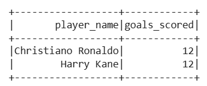

- Show the player_name who played the most matches, (Columns to show:player_name, matches).
    ```python
    most_matches = df1.select(max(df1.matches)).collect()[0][0]

    df1.filter(df1.matches == most_matches).select("player_name", "matches").show()
    ```
    ```python
    total_matches = df1.groupBy("player_name").agg(sum("matches").alias("matches"))

    max_match = total_matches.select(max(total_matches.matches)).collect()[0][0]

    total_matches.filter(total_matches.matches == max_match).select("player_name", "matches").show()
    ```
    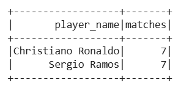

---

# [Solution 2](https://github.com/RahulRoy-rsp/Learning_PySpark/blob/main/Aggregation_Operations/df-agg-exercise.md#exercise-2-read-a-csv-file-and-create-a-dataframe-using-it-with-specific-data-types-and-do-the-following-operation-file-name-players2csv)

- Reading a csv and creating a dataframe with specific schema.
    ```python
    # Defining the schema
    schema = StructType([
        StructField("player_name", StringType(), True),
        StructField("age", StringType(), True),
        StructField("gender", StringType(), True),
        StructField("country", StringType(), True)
    ])

    df2 = spark.read.csv("players2.csv", header=True, schema=schema)
    ```

- Display the Dataframe
    ```python
    df2.show()
    ```
    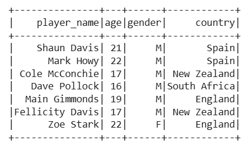

- Show only the first five records of the DataFrame sorted by age.
    ```python
    df2.sort("age", ascending=False).show(5)
    ```
    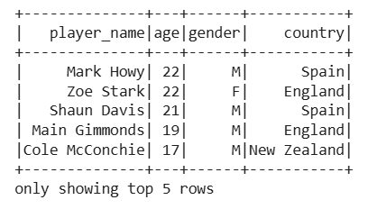

- Derive two new fields first_name and last_name using player_name. (first_name and last_name is separated by space) & display the dataframe.
    ```python
    from pyspark.sql.functions import split

    new_df2_1 = df2.withColumn("first_name", split(df2["player_name"], " ").getItem(0)) \
                .withColumn("last_name", split(df2["player_name"], " ").getItem(1))

    new_df2_1.show()
    ```
    ```python
    from pyspark.sql.functions import expr

    new_df2_2 = df2.withColumn("first_name", expr("split(player_name, ' ')[0]")) \
                .withColumn("last_name", expr("split(player_name, ' ')[1]"))

    new_df2_2.show()
    ```
    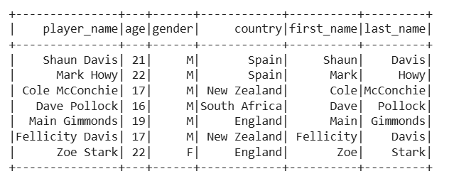

- Show the schema of the dataframe.
    ```python
    new_df2_1.printSchema()
    ```
    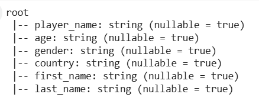

- Derive a new field Is_Eligible. (Assign it as True if the age is less than 21, else False).
    ```python
    from pyspark.sql.functions import col, when

    new_df2_1 = new_df2_1.withColumn("Is_Eligible", when(col("age") < 21, True).otherwise(False))

    new_df2_1.show()
    ```

    ```python
    from pyspark.sql.functions import col, when

    new_df2_2 = new_df2_2.withColumn("Is_Eligible", expr("age < 21"))

    new_df2_2.show()
    ```
    


- Show the records who has Is_Eligible as True.
    ```python
    new_df2_2.filter(new_df2_2.Is_Eligible).show()
    ```
    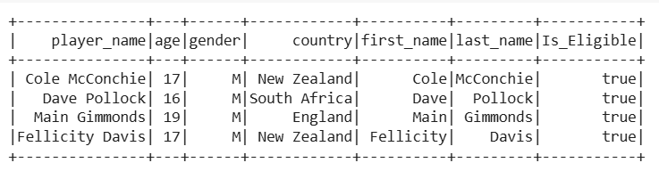

- Show the records who has Is_Eligible as False.
    ```python
    new_df2_2.filter(new_df2_2.Is_Eligible == False).show()
    ```
    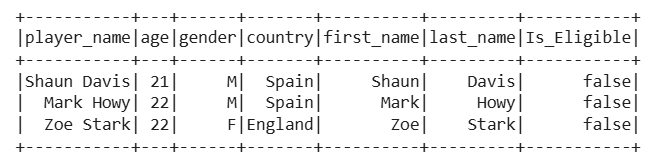


---

| References |
| ---------- |
**[Creating Dataframes](https://github.com/RahulRoy-rsp/Learning_PySpark/blob/main/Dataframes/dataframes.md#creating-dataframes-in-pyspark)**
**[Dataframe Operations](https://github.com/RahulRoy-rsp/Learning_PySpark/blob/main/Dataframe_Operations/df-operations.md#pyspark-dataframe-operations)**
**[Aggregation Operations](https://github.com/RahulRoy-rsp/Learning_PySpark/blob/main/Aggregation_Operations/df-agg-operations.md#pyspark-dataframe-aggregation-methods)**
**[Questions](https://github.com/RahulRoy-rsp/Learning_PySpark/blob/main/Aggregation_Operations/df-agg-exercise.md#pyspark-dataframe-aggregation-operations-exercise)**
**[Download CSV](https://github.com/RahulRoy-rsp/Learning_PySpark/tree/main/Aggregation_Operations/csv_files)**

---
**[Back to Home Page](https://github.com/RahulRoy-rsp/Learning_PySpark)**
