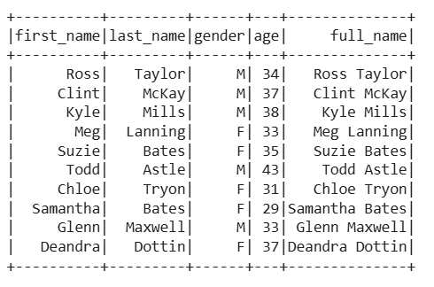

### Initialising pyspark setup in google colab
```bash
!pip install pyspark
```
```bash
!pip install -q findspark
```
```bash
import findspark
findspark.init()
```

---

### Creating Spark Session
```python
# creating a spark session that will be used to perform all the necessary task on Spark
from pyspark.sql import SparkSession
spark = SparkSession.builder.master("local[*]").appName('df-operations-exercise').getOrCreate()
spark
```

---

# [Solution 1](https://github.com/RahulRoy-rsp/Learning_PySpark/blob/main/Dataframe_Operations/df-operations-exercise.md#exercise-1-create-a-dataframe-and-do-the-following-operation)

- Creating dataframe and inserting records.
    ```python
    # data for the dataframe
    data = [
        ("Mark Boucher", 42, "Cape Town", "South Africa"),
        ("Shaun Pollock", 48, "Durban", "South Africa"),
        ("Brendon McCullam", 39, "Wellington", "New ZeaLand"),
        ("Saurav Ganguly", 44, "Mumbai", "India"),
        ("Shoaib Akhtar", 41, "Rawalpindi", "Pakistan")
    ]

    # Creating the DataFrame
    ex1_df = spark.createDataFrame(data, ["Name", "Age", "City", "Country"])
    ```

- Displaying the dataframe.
    ```python
    ex1_df.show()
    ```
    

- Show the dataframe with only the following columns: Name and Country.
    ```python
    ex1_df.select("Name", "Country").show()
    ```
    

- Show the dataframe sorted by the column Age in descending order.
    ```python
    ex1_df.sort("Age", ascending=False).show()
    ```
    ```python
    from pyspark.sql.functions import col

    ex1_df.orderBy(col("Age").desc()).show()
    ```
    

- Show the columns available in the dataframe.
    ```python
    ex1_df.columns
    ```
    


- Drop the column Age from the Dataframe..
    ```python
    ex1_df = ex1_df.drop("Age")
    ```

- Show the schema of the dataframe as of now.
    ```python
    ex1_df.printSchema()
    ```
    

- Show the records from the dataframe where the Country is South Africa.
    ```python
    ex1_df.filter(ex1_df.Country == "South Africa").show()
    ```
    

---

# [Solution 2](https://github.com/RahulRoy-rsp/Learning_PySpark/blob/main/Dataframe_Operations/df-operations-exercise.md#exercise-2-read-a-csv-file-and-create-a-dataframe-using-it-with-specific-data-types-and-do-the-following-operation-file-name-players1csv)

- Reading a csv and creating a dataframe with specific schema.
    ```python
    from pyspark.sql.types import StructType, StructField, StringType, IntegerType

    # Defining the schema
    schema = StructType([
        StructField("first_name", StringType(), True),
        StructField("last_name", StringType(), True),
        StructField("gender", StringType(), True),
        StructField("age", IntegerType(), True)
    ])

    ex2_df = spark.read.csv("players1.csv", header=True, schema=schema)

    ex2_df.show()
    ```

- First five records of the DataFrame
    ```python
    ex2_df.show(5)
    ```
    

- Show the number of counts of each gender.
    ```python
    from pyspark.sql.functions import count

    gender_group_count = ex2_df.groupBy("gender").agg(count("*").alias("Cnt")).show()
    ```
    

- Show the first_name, last_name and the age of the player who is the youngest in the whole dataframe.
    ```python
    from pyspark.sql.functions import min
    youngest_player = ex2_df.orderBy("Age").select("first_name", "last_name", "Age").limit(1).show()
    ```

    ```python
    min_age = ex2_df.select(min("age")).collect()[0][0]
    ex2_df.filter(ex2_df.age == min_age).select("first_name", "last_name", "Age").show()
    ```
    

- Show the first_name, last_name, gender and the age of the player who is the oldest among their gender in the whole dataframe.
    ```python
    from pyspark.sql.functions import max

    oldest_by_gender = ex2_df.groupBy("gender").agg(max("age").alias("max_age"))
    oldest_players = ex2_df.join(oldest_by_gender.drop("gender"), (ex2_df.gender == oldest_by_gender.gender) & (ex2_df.age == oldest_by_gender.max_age)) \
                        .select(ex2_df.first_name, ex2_df.last_name, ex2_df.gender, ex2_df.age)

    oldest_players.show()
    ```

    ```python
    from pyspark.sql.window import Window
    from pyspark.sql.functions import rank

    # Defining a window partitioned by gender, ordered by age descending
    window_spec = Window.partitionBy("gender").orderBy(col("age").desc())

    # Ranking players within each gender by age
    df_ranked = ex2_df.withColumn("rank", rank().over(window_spec))

    # Select the players with rank 1 (oldest)
    oldest_players = df_ranked.filter(col("rank") == 1).select("first_name", "last_name", "gender", "Age")
    oldest_players.show()
    ```
    <!--  -->

- Add another column full_name which would be the concatenation of first_name and last_name in the dataframe.
    ```python
    from pyspark.sql.functions import concat_ws
    ex2_df = ex2_df.withColumn("full_name", concat_ws(" ", col("first_name"), col("last_name")))

    ex2_df.show()
    ```

    ```python
    from pyspark.sql.functions import expr

    df = ex2_df.withColumn("full_name", expr("first_name || ' ' || last_name"))
    df.show()
    ```
    


- Show the schema of the dataframe
    ```python
    ex2_df.printSchema()
    ```
    

- Show the records for those who have age greater than 35.
    ```python
    ex2_df.where(ex2_df.age > 35).show()
    ```
    


---

| References |
| ---------- |
**[Creating Dataframes](https://github.com/RahulRoy-rsp/Learning_PySpark/blob/main/Dataframes/dataframes.md#creating-dataframes-in-pyspark)**
**[Dataframe Operations](https://github.com/RahulRoy-rsp/Learning_PySpark/blob/main/Dataframe_Operations/df-operations.md#pyspark-dataframe-operations)**
**[Questions](https://github.com/RahulRoy-rsp/Learning_PySpark/blob/main/Dataframe_Operations/df-operations-exercise.md)**
**[Download CSV](https://github.com/RahulRoy-rsp/Learning_PySpark/tree/main/Dataframe_Operations/csv-files)**
**[Notebook Solution](https://github.com/RahulRoy-rsp/Learning_PySpark/blob/main/Dataframe_Operations/df_operations_exercise.ipynb)**
---
**[Back to Home Page](https://github.com/RahulRoy-rsp/Learning_PySpark)**
