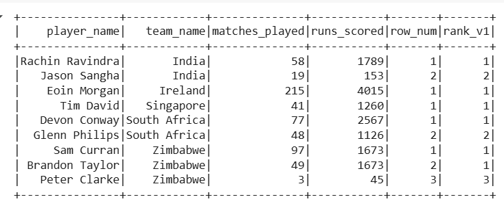

### Initialising pyspark setup in google colab
```bash
!pip install pyspark
```
```bash
!pip install -q findspark
```
```bash
import findspark
findspark.init()
```

---

### Creating Spark Session
```python
# creating a spark session that will be used to perform all the necessary task on Spark
from pyspark.sql import SparkSession
spark = SparkSession.builder.master("local[*]").appName('df-functions-solutions').getOrCreate()
spark
```

---

# [Solution 1]()

- Create a DataFrame with specific columns and datatypes & Insert records

    ```python
    from pyspark.sql.types import StructType, StructField, StringType, IntegerType

    # Defining the schema
    schema = StructType([
        StructField("player_name", StringType(), True),
        StructField("team_name", StringType(), True),
        StructField("matches_played", IntegerType(), True),
        StructField("runs_scored", IntegerType(), True)
    ])

    # data for the dataframe
    data = [
    ("Tim David", "Singapore", 41, 1260),
    ("Devon Conway", "South Africa", 77, 2567),
    ("Glenn Philips", "South Africa", 48, 1126),
    ("Eoin Morgan", "Ireland", 215, 4015),
    ("Rachin Ravindra", "India", 58, 1789),
    ("Sam Curran", "Zimbabwe", 97, 1673),
    ("Jason Sangha", "India", 19, 153)
    ]

    # Creating the DataFrame
    df1 = spark.createDataFrame(data, schema=schema)
    ```

- Displaying the dataframe.
    ```python
    df1.show()
    ```
    


- Add a new column `row_num` that assigns a unique row number for each `team_name` ordered by `runs_scored` in descending order and show the dataframe.
    ```python
    from pyspark.sql import functions as F
    from pyspark.sql.window import Window

    runs_scored_by_team_window = Window.partitionBy("team_name").orderBy(df1.runs_scored.desc())
    df1 = df1.withColumn("row_num", F.row_number().over(runs_scored_by_team_window))

    df1.show()
    ```

    

- Add a new column `rank_v1` that ranks players within their `team_name` based on `runs_scored` (ties will have the same rank, but gaps exist) and show the dataframe.
    ```python
    df1 = df1.withColumn("rank_v1", F.rank().over(runs_scored_by_team_window))

    df1.show()
    ```
    


- Add a new column `rank_v2` that ranks players within their `team_name` based on `runs_scored` (no gaps in ranking) and show the dataframe.
    ```python
    df1 = df1.withColumn("rank_v2", F.dense_rank().over(runs_scored_by_team_window))

    df1.show()
    ```
    

- Compute the cumulative sum of `runs_scored` within each `team_name` ordered by `matches_played` and show the dataframe.
    ```python
    cumulative_window = Window.partitionBy("team_name").orderBy("matches_played").rowsBetween(Window.unboundedPreceding, Window.currentRow)
    df1 = df1.withColumn("cumulative_sum", F.sum("runs_scored").over(cumulative_window))

    df1.show()
    ```
    


---

# [Solution 2](df-functions-exercise.md#exercise-2-user-defined-functions-udfs)

- Create a DataFrame with specific columns and datatypes & Insert records
    ```python
    schema = StructType([
        StructField("player_name", StringType(), True),
        StructField("age", IntegerType(), True),
        StructField("role", StringType(), True),
        StructField("team_name", StringType(), True),
        StructField("runs_scored", IntegerType(), True)
    ])

    data = [
        ("Sachin Tendulkar", 50, "Batsman", "India", 18426),
        ("Jacques Kallis", 48, "All-Rounder", "South Africa", 11579),
        ("Muttiah Muralitharan", 52, "Bowler", "Sri Lanka", 126),
        ("AB de Villiers", 39, "Batsman", "South Africa", 9577),
        ("Michael Hussey", 48, "Batsman", "Australia", 5442),
        ("Glenn McGrath", 54, "Bowler", "Australia", 12),
    ]

    df2 = spark.createDataFrame(data, schema)
    ```

- Display the Dataframe
    ```python
    df2.show()
    ```
    

- Create a **UDF** to classify players based on runs scored:
   - If `runs_scored` > 10,000 → "Legend"
   - If `runs_scored` between 5,000 and 10,000 → "Star Player"
   - Otherwise → "Emerging Player".
    ```python
    from pyspark.sql.functions import udf

    def classify_players(runs):
    if runs > 10000:
        return "Great Batter"
    elif 5000 <= runs <= 10000:
        return "Good Batter"
    else:
        return "Not a good Batter yet"
    ```

- Apply this UDF and display a new column `"category"`.
    ```python
    classify_players_udf = udf(classify_players, StringType())
    df2 = df2.withColumn("category", classify_players_udf("runs_scored"))
    ```
- Show the Dataframe
    ```python
    df2.show(truncate=False)
    ```
    

- Create a `UDF to extract the first name and last name` from `player_name` and add two new columns: `"first_name"` and `"last_name"`.
    ```python
    def get_first_name(name):
    return name.split(" ")[0]

    def get_last_name(name):
    return name.split(" ")[-1]

    first_name_udf = udf(get_first_name, StringType())
    last_name_udf = udf(get_last_name, StringType())

    df2 = df2.withColumn("first_name", first_name_udf("player_name"))
    df2 = df2.withColumn("last_name", last_name_udf("player_name"))
    ```
- Display the Dataframe.
    ```python
    df2.show(truncate=False)
    ```
    

- Create a `UDF to check if a player is eligible for veteran status` (`age >= 45` should return `True`, otherwise `False`). Add a new column `"is_veteran"`. Display the dataframe
    ```python
    from pyspark.sql.types import BooleanType

    def is_veteran(age):
    return age >= 45

    veteran_udf = udf(is_veteran, BooleanType())
    df2 = df2.withColumn("is_veteran", veteran_udf("age"))

    df2.show(truncate=False)
    ```

    


- Create a **UDF to generate a full descriptive name**, combining `player_name`, `role`, and `team_name` in the format:  
   **"Sachin Tendulkar (Batsman From India)"**  
   Name this new column as `"player_description"`.
    ```python
    def player_description(name, role, team):
    return f"{name} ({role} From {team})"

    desc_udf = udf(player_description, StringType())
    df2 = df2.withColumn("player_description", desc_udf("player_name", "role", "team_name"))
    ```
- Display the Dataframe.
    ```python
    df2.show(truncate=False)
    ```
    

---

| References |
| ---------- |
**[Window Functions](df-functions.md#pyspark-window-functions)**  
**[User-Defined Functions (UDFs)](df-functions.md#pyspark-user-defined-functions-udfs)**
**[Creating Dataframes](/Dataframes/dataframes.md#creating-dataframes-in-pyspark)**
**[Dataframe Operations](/Dataframe_Operations/df-operations.md#pyspark-dataframe-operations)**
**[Questions](df-functions-exercise.md)** 


---
**[Back to Home Page](https://github.com/RahulRoy-rsp/Learning_PySpark)**
